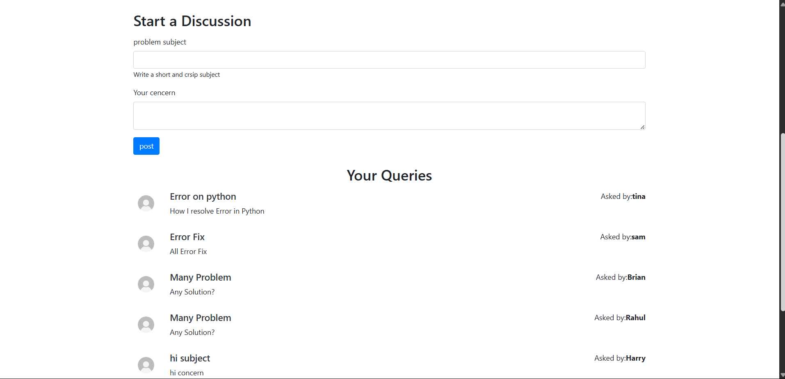

<h1>🗣️ Forum Website</h1>
<em>
An interactive forum web application built with (e.g. React/Node.js, Django/Flask, or Laravel/Vue etc.), enabling users to browse programming categories, create discussion threads, and engage with other users in a community-driven Q&A environment.
</em>

Logged out view: browse topics, sign up/login

<h2>🔍 Features</h2>
<ul>
<li>Browse by Category: Users can select from programming categories (e.g., Flutter, Python, Bootstrap, Java, PHP, AngularJS) and view threads in each category.</li>

<li><ul>Authentication:

<li>Guests can browse categories and view threads.</li>

<li>Registered users can sign up, log in, log out (with feedback messages like “logout successfully!”), and post new threads or replies.</li>
</ul></li>

<li>Post Discussions: Authenticated users can submit a subject and detailed message to start a discussion thread.</li>

<li>View Queries: Threads show the author name and message. Users can scroll to view queries, replies, and multiple posts by the same user.</li>

<li>Search: A global search bar to find threads across all categories.</li>

<li>Responsive UI: Clean, mobile-friendly layout inspired by Bootstrap or a CSS framework.</li>
</ul>

🧩 Tech Stack
| Layer          | Technology                                                                       |
| -------------- | -------------------------------------------------------------------------------- |
| Frontend       | HTML5, CSS3, JavaScript (Bootstrap or TailwindCSS, optionally React/Vue/Angular) |
| Backend        | PHP (Laravel)                                                                    |
| Database       | MySQL / PostgreSQL / MongoDB                                                     |
| Authentication | Sessions, JWT, or built-in Auth                                                  |
| Deployment     | Heroku, Netlify, Vercel, or self-hosted                                          |

<h2>🚀 Getting Started</h2>
Prerequisites
<ul>
<li>PHP installed</li>
<li>Database (MySQL/PostgreSQL/MongoDB)</li>
<li>Git</li>
</ul>

<h2>1. Installation</h2>
  
Clone the repo

  <code>git clone https://github.com/Sayan-AdhikaryM10/Forum_Websit.git
  cd forum-website</code>

<h2>2.Install dependencies</h2>
  
PHP / Laravel example:

 <code>composer install
  php artisan migrate
  php artisan serve</code> 

<h2>3. Configure environment variables</h2>
   
Create a .env file with your database credentials, secret keys, etc.

<h2>4. Access the app</h2>
    
Navigate to http://localhost:PORT/ to explore the app.

    <ul>
    <li>Browse categories</li>
    <li>Sign up / log in</li>
    <li>Start new threads or post replies</li>
    </ul>

<h2>📂 Project Structure</h2>
/Forum 
├── vscode/ 
      ├── settings.json 
├── assets/ 
      ├── about.php 
      ├── contact.php 
      ├── dbconnect.php 
      ├── footer.php 
      ├── header.php 
      ├── login.php 
      ├── loginhandle.php 
      ├── logout.php 
      ├── search.php 
      ├── signup.php 
      ├── signuphandle.php 
├── dataBase/  
      ├── forum.sql 
├── img/ 
├── databace.txt 
├── index.php 
├── threadlist.php 
├── threads.php
    
<ul>
<li> backend/: Authentication, thread CRUD, database models </li>

<li> frontend/: HTML templates (e.g., EJS, Django templates, Blade)</li>

<li> public/: CSS styling and carousel images </li>

<ul>
<h2>📸 Screenshots</h2>

</ul>

<h2>🎯 To-Do & Future Enhancements</h2>
<ul>
<li> Pagination for threads & replies</li>
<li> User profiles with avatars and post counts </li>
<li> Thread search with filters (by category/date/author)</li>
<li> Upvoting/downvoting or marking answers as “accepted”</li>
<li> Notifications for replies</li>
<li> Mobile responsive design improvements</li>
</ul>

<h2>🙌 Contributing</h2>
<ol type="1">
<li>Fork the repository </li>

<li>Create your feature branch (git checkout -b feature/AwesomeFeature)</li>

<li>Commit your changes (git commit -m "Add awesome feature")</li>

<li>Push to the branch (git push origin feature/AwesomeFeature)</li>

<li>Open a Pull Request and describe your improvements </li>
</ol>

<h2>📝 License </h2>

Distributed under the MIT License. See LICENSE for details.

<h2>📧 Contact</h2>
Maintainer: Sayan Adhikary 
Email:  sayanadhikary831@gmail.com 
Portfolio: https://sayanadhikary.free.nf/

